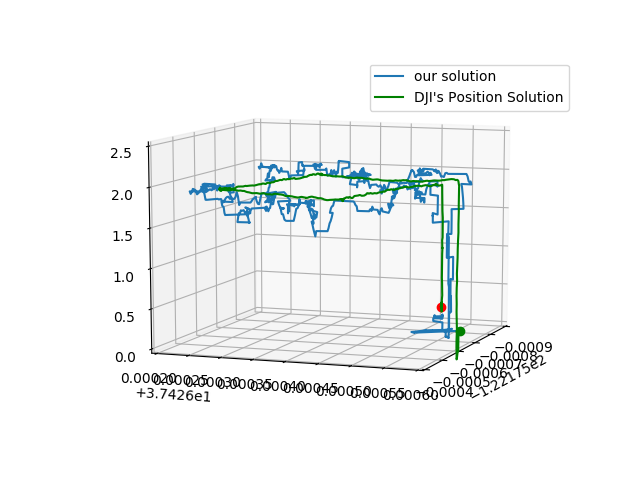

# gnss-sensor-fusion
Extended Kalman Filter (EKF) for position estimation using raw GNSS signals, IMU data, and barometer. The provided raw GNSS data is from a Pixel 3 XL and the provided IMU & barometer data is from a consumer drone flight log.  
  
Project overview presentation can be viewed [here](https://youtu.be/m7BPbx05Vro).

## Setup
This repo was built using Python3. A number of packages are needed to run all files including at least:  
`pip3 install pandas numpy scipy pymap3d pyproj progress`

## Run
The full gnss sensor fusion can be run with:  
`python3 gnss_fusion_ekf.py`  
Change the filepaths at the end of the file to specify odometry and satellite data files.
The current default is to use raw GNSS signals and IMU velocity for an EKF that estimates latitude/longitude and the barometer and a static motion model for a second EKF that estimates altitude. Instead of raw GNSS psuedoranges, you can also use GPS LLA estimates which most receivers provide. States for all EKFs are [ECEF X, ECEF Y, ECEF Z, GNSS time bias]. It currently runs weighted least squares to obtain an initial estimate for the time bias.

An EKF using ONLY raw GNSS signals to estimate position can be run with:   
`python3 gnss_only_ekf.py`   
It currently runs weighted least squares to obtain an initial estimate for the time bias. It assumes a static motion model. The weighted least square position solution is also saved to file. States for the EKF are [ECEF X, ECEF Y, ECEF Z, GNSS time bias].

A toy 3 DOF example can be run with:  
`python3 gnss_only_ekf_toy.py`
